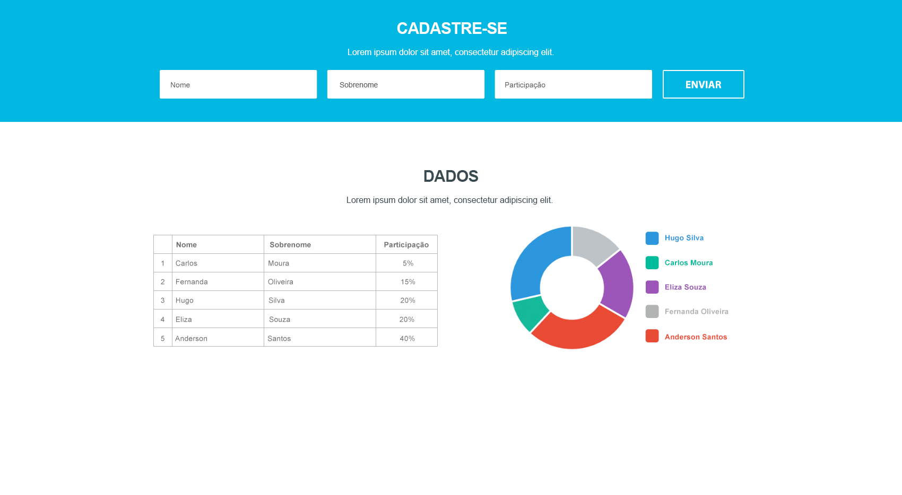

# Documentation

1. Here it's my partial solution for Cotabox Fullstack Challenge.

Bellow you can see the compiled JavaScript files working as a Github Page, without need to install anything ;)

https://danielramosbh74.github.io/tests/Cotabox-fullstack-challenge-prod/Cotabox-fullstack-challenge/

2. Used technologies:

- Angular
- Ng2-charts module, that uses Chart.js library
- In-memory Web API, that simulates a data storage and it's connection

## Installation

- To run this Angular App in a development server, just clone this repository localy and **follow general instructions for any Angular app**:

Run `ng serve` for a dev server. Navigate to `http://localhost:4200/`. The app will automatically reload if you change any of the source files.

## Considerations

1. Considering that simple things usually works better, instead of start from scratch, first of all, I've done an abstraction and an **analogy with the "Heroes" in "Tour of Heroes" Angular Tutorial** as the "Employees" or any kind "User" and **I was trying to implement the fullstack, but... later I decided to focus in the Frontend...** to manage to deliver the project until its deadline. 

2. The summary in the end of each lesson in ["Tour of heroes" tutorial](https://github.com/danielramosbh74/Cotabox-fullstack-challenge#angulartourofheroes) shows many benefits in using its approach to this challenge, specially the section "Get data from a server", that probably will be used as a skeleton to another projects.

3. I have a deadline to deliver this challenge, so I'm going to work on it until the deadline.

This documentation will be modified until it's date and, maybe, after this date too if I decide to continue to improve its solution to this challenge just to learn more, eventhought I don't be the selected candidate.

4. I'm delivering the project in a few minutes, on 07/22/2020, because I realy can't invest more time on it next days... 

So, I coudn't do all project requirements and some improvments that I'd like to do...

xxxxxxxxxxxxxxxxxxxxxxxxxx

xxxxxxxxxxxxxxxxxxxxxxxxxx

  

# { "developer": "fullstack" }

The objective of this challenge is to evaluate your domain in fullstack development: its organization, style and good practices with code, APIs creation, frameworks knowledge and technologies.

## Rules

1. Your code should be made available in a public or private repository, on your personal github or bitbucket. But, if you preffer, create a Pull Request with your application;
2. Send the link to desenvolvimento@cotabox.com.br;
3. We use VueJS and Node.js with MongoDB, but you can feel free to choose other technologies;

## Challenge

### Front-end

The following layout should be developed

[You can download the PSD here](layout-onepage.psd)

- You can use the libs and frameworks that make you more comfortable;
- All fields are required in the form;
- We'll be happy if you develop tests for it;

### Back-end

The layout has a form, a table with percentage information of participation and a pizza graph that represents this distribution.

- You need to create APIs that sends and receives these informations;
- We'll be happy if you develop tests for it;
- In case of inconsistency, return the error in a structured JSON with HTTP 400 code;

#### Plus

Feel free to make improviments like new funcionalities, visual optimizations, API security, etc. 😉

## Questions?

Send your questions directly to desenvolvimento@cotabox.com.br or opening a issue.

xxxxxxxxxxxxxxxxxxxxxxx

# AngularTourOfHeroes

This project was generated with [Angular CLI](https://github.com/angular/angular-cli) version 10.0.3.

## Development server

Run `ng serve` for a dev server. Navigate to `http://localhost:4200/`. The app will automatically reload if you change any of the source files.

## Code scaffolding

Run `ng generate component component-name` to generate a new component. You can also use `ng generate directive|pipe|service|class|guard|interface|enum|module`.

## Build

Run `ng build` to build the project. The build artifacts will be stored in the `dist/` directory. Use the `--prod` flag for a production build.

## Running unit tests

Run `ng test` to execute the unit tests via [Karma](https://karma-runner.github.io).

## Running end-to-end tests

Run `ng e2e` to execute the end-to-end tests via [Protractor](http://www.protractortest.org/).

## Further help

To get more help on the Angular CLI use `ng help` or go check out the [Angular CLI README](https://github.com/angular/angular-cli/blob/master/README.md).
